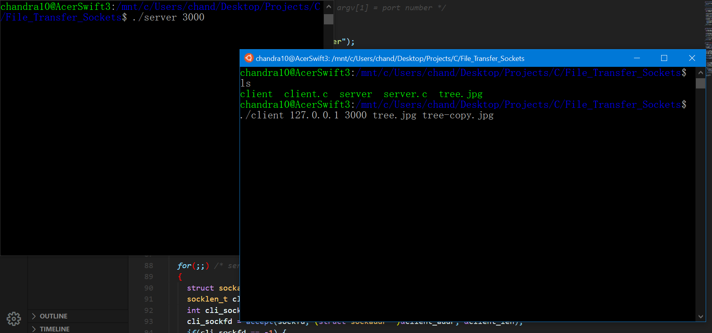
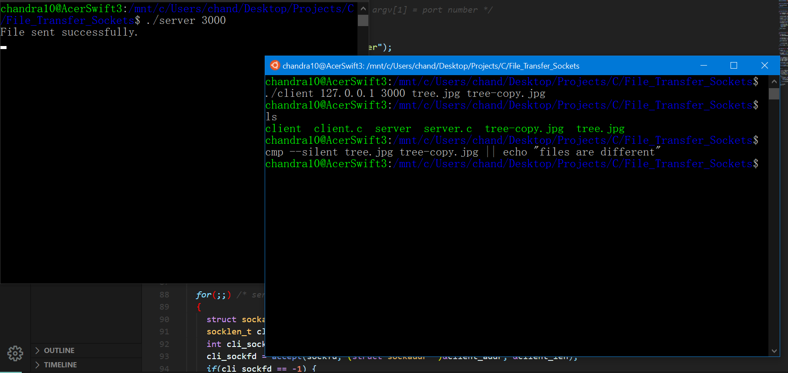
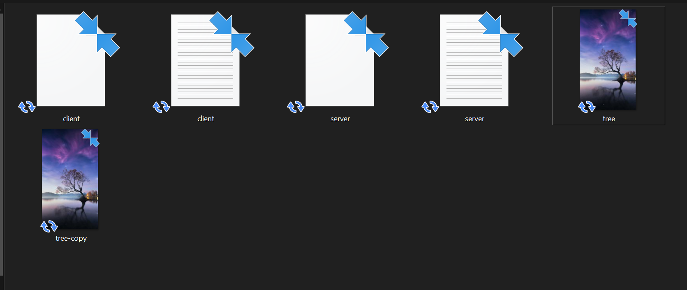

# Remote File Transfer

Transfers any file type (.gif, .png, .txt...etc) requested by client to a provided file path from server, provided server has read access to requested file.

* [What program looks like](#what-program-looks-like)
* [Features](#features)
* [Dependencies](#dependencies)
* [How to run program](#how-to-run-program)

## What program looks like

## Features

* Transfer files remotely or locally (use 127.0.0.1 as Server IPv4 address argument) from one location to another in an instant

## Dependencies

* GCC - (For Windows: [MinGW](https://osdn.net/projects/mingw/releases/))

## How to run program

**Note: server.c and client.c do not have to be in the same folder, only the port number provided must be the same. For simplicity, the below steps assumes they are in same folder.**

1. Fork/download manually/clone the repo.
2. Open two terminals (one to run server.c and one for client.c).
3. On both terminals, cd (change directory) into the local copy of the repo.
4. On one terminal, enter "gcc server.c -o server".
5. On the other terminal, enter "gcc client.c -o client".
6. In the first terminal, enter "./server 3000".
    * **server.c requires 1 command-line argument, the port number (port number is 3000 in the case above).**
7. In the second terminal, enter "./client 127.0.0.1 3000 tree.jpg tree-copy.jpg".
    * **client.c requires 4 command-line arguments: the Server IPv4 address (in dot notation), port number**
      **(same number used in server.c), requested filename path, and new filename path, respectively.**
